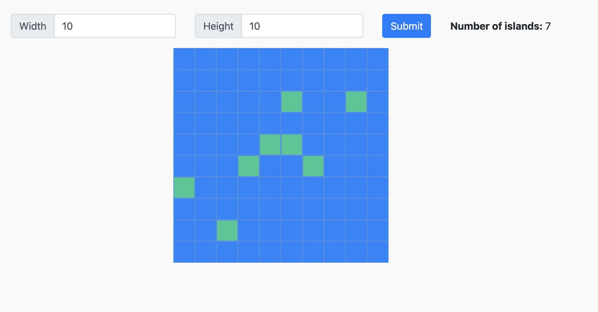

# Number of Islands

## Requirements
* node >= v12.13.0
* npm >= 6.12.0

## Install dependencies
`npm install` or `yarn add`

## Start the application
* `NODE_OPTIONS=--openssl-legacy-provider npm start`

## Run tests
* `npm run test:unit` for unit tests
* `npm run test:components` for components tests
* `npm run test` for both, unit and component tests

This is a visual answer of the next exercise from Leetcode:
https://leetcode.com/problems/number-of-islands/

Using React, Jest for testing the components and mocha for some unit tests.

